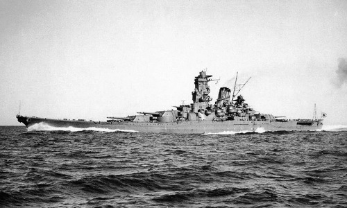

<mbp:pagebreak />

Yamato Nadesiko
===============

Yamato Damashi
--------------

Las expresiones *yamato damashii* (大和魂, el gran espíritu del *wa*) y *yamato gokoro* (大和心, el gran corazón del *wa*) se utilizan para referirse al sentido común, sabiduría compartida y sensibilidad única del pueblo japonés. En ocasiones se utiliza para expresar la quintaesencia de lo japonés, la pureza y fuerza del espíritu de los japoneses para superar cualquier reto en la vida.

El acorazado Yamato 
-------------------
Junto con el Musashi, también de la armada imperial japonesa, fueron los barcos de guerra más poderosos jamás construidos. 

